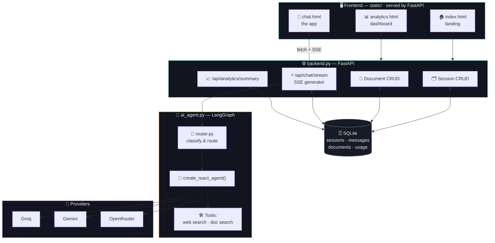
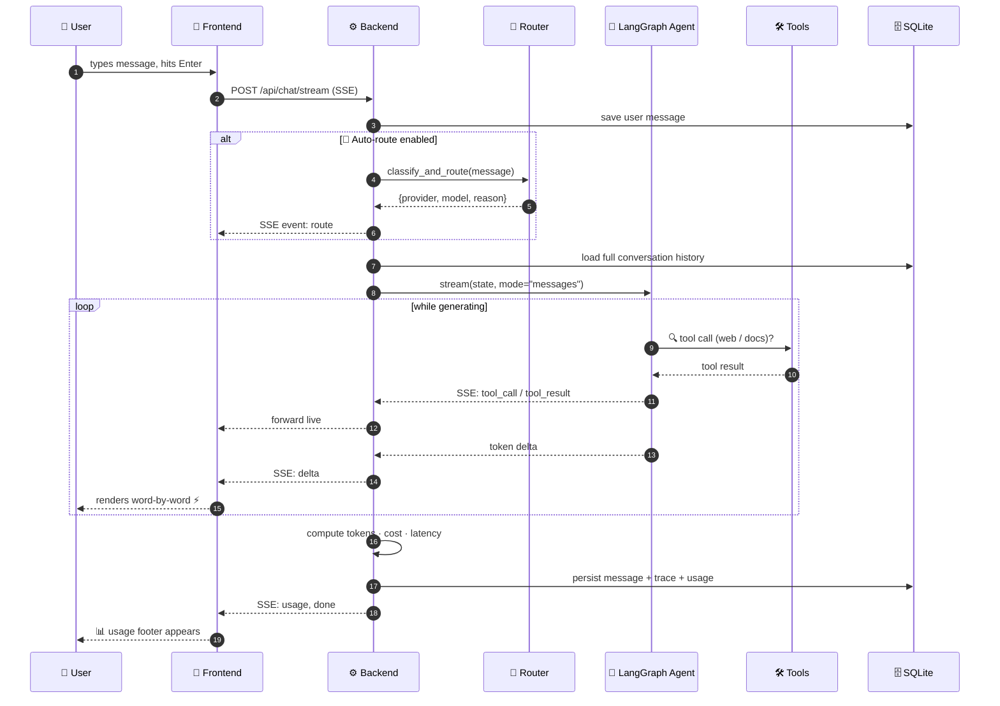
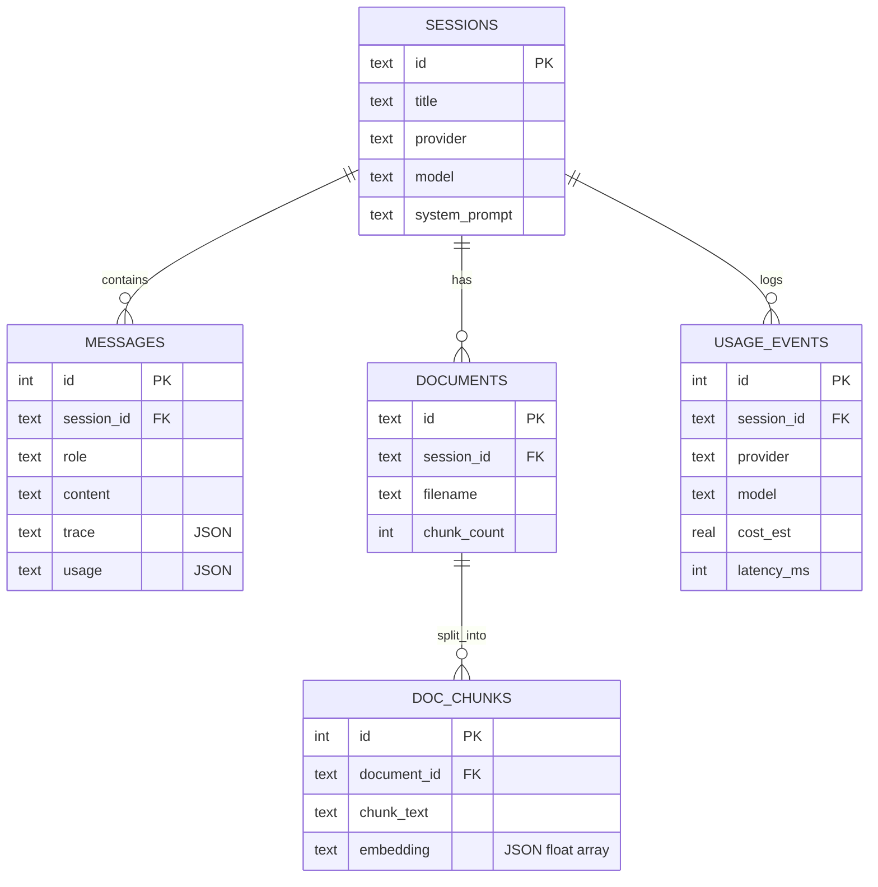

<div align="center">


<br><br>

# 🤖⚡AgentFlow - Agentic AI Chatbot

### One interface. Three model engines. Full agent transparency.

<p>


</p>

<p>


</p>

**[🚀 Quick Start](#-quick-start)** · **[🏗️ Architecture](#️-architecture)** · **[✨ Features](#-features)** · **[🔌 API](#-api-reference)** · **[☁️ Deploy](#️-deployment)**

</div>

---

## 📖 What is this?

A **multi-provider, tool-using LangGraph agent** wrapped in a FastAPI backend and a custom, framework-free frontend. It's not a ChatGPT clone — it's an agent-orchestration playground that happens to look like one:

| | |
|---|---|
| 🧠 **3 interchangeable brains** | Groq · Gemini · OpenRouter, swappable mid-conversation |
| 📎 **RAG on your own files** | Upload a PDF, the agent gains a `search_documents` tool |
| 🧭 **Live Reasoning Trace** | Watch every tool call happen, in real time, not a fake spinner |
| 🧭 **Smart Model Router** | A classifier auto-picks the cheapest capable model per message |
| 📊 **Cost & latency analytics** | Every message logged, rolled into charts |
| 💾 **Real persistence** | SQLite-backed sessions, survives restarts |
| ⚡ **True token streaming** | Server-Sent Events, word-by-word |

---

## 📸 Gallery

<table>
<tr>
<td width="50%">

<p align="center"><sub>🏠 Landing — process breakdown & capability grid</sub></p>
</td>
<td width="50%">

<p align="center"><sub>💬 Chat — provider select, web search, auto-route</sub></p>
</td>
</tr>
<tr>
<td width="50%">

<p align="center"><sub>⌨️ Active session — usage footer per message</sub></p>
</td>
<td width="50%">

<p align="center"><sub>📊 Analytics — cost, tokens & latency, charted</sub></p>
</td>
</tr>
</table>

---

## 🏗️ Architecture



---

## 🔁 Request Workflow

What actually happens when you hit send — end to end:



---

## ✨ Features

<table>
<tr>
<td width="33%" valign="top">

### 🧭 Live Reasoning Trace
Every tool call — web search or document search — streams in as a structured event (`tool_call` → `tool_result`), not a fake "thinking…" spinner. Persisted per-message so it's still there when you reopen a session.

</td>
<td width="33%" valign="top">

### 📎 RAG on Your Files
Upload a PDF or text file → chunked → embedded (Gemini `text-embedding-004`) → stored in SQLite. No external vector DB. The agent gains a `search_documents` tool it can *choose* to call.

</td>
<td width="33%" valign="top">

### 🧠 Smart Model Router
Flip on **Auto-route** and a regex-based classifier reads each message — code markers, reasoning cues, length — and picks Groq / Gemini / OpenRouter accordingly. The *why* shows up in the trace.

</td>
</tr>
<tr>
<td width="33%" valign="top">

### 📊 Usage Analytics
Every message logs estimated tokens, cost (against real published rates), and latency. Rolled up into hand-rolled SVG/CSS charts — no charting library dependency.

</td>
<td width="33%" valign="top">

### 💬 Real Memory
Full chat history — not just the last message — is sent to the agent every turn via `_history_to_state()`. It remembers what you said three messages ago.

</td>
<td width="33%" valign="top">

### ⚡ Token Streaming
`agent.stream(state, stream_mode="messages")` → Server-Sent Events → a manually-parsed `ReadableStream` on the client. No polling, no spinners.

</td>
</tr>
</table>

---

## 🧩 Core Modules

```
📦 personal-agentic-chatbot
├── 🧠 ai_agent.py         LLM factory · tool factory · agent factory · streaming
├── ⚙️ backend.py          FastAPI · SQLite schema · SSE endpoints
├── 📎 rag.py              Chunking · embeddings · cosine-similarity retrieval
├── 🧭 router.py           Query classifier · cost table
├── 🎨 static/
│   ├── 🏠 index.html      Landing page
│   ├── 💬 chat.html       The application
│   ├── 📊 analytics.html  Usage dashboard
│   ├── 🎨 style.css       Shared design tokens
│   ├── 🎨 landing.css     Landing-specific styles
│   ├── 🎨 analytics.css   Dashboard-specific styles
│   ├── ⚡ script.js       SSE client · trace rendering · doc upload
│   ├── ✨ landing.js      Scroll-reveal animation
│   └── 📈 analytics.js    Chart rendering
├── 🐳 Dockerfile
├── 📄 requirements.txt / Pipfile
└── 📘 README.md
```

<details>
<summary><b>🔍 Click to expand — what each module actually does under the hood</b></summary>

<br>

**`ai_agent.py`**
- `_build_llm()` — instantiates `ChatGroq` / `ChatGoogleGenerativeAI` / `ChatOpenAI` (OpenRouter via `base_url` override)
- `_build_tools()` — conditionally attaches `TavilySearchResults` and/or a `StructuredTool` wrapping the RAG search closure
- `_build_agent()` — calls `create_react_agent(model, tools, prompt=...)`, with a `try/except` fallback to the older `state_modifier=` kwarg for version safety
- `stream_response_from_ai_agent()` — the streaming generator: accumulates fragmented `tool_call_chunks` by ID, matches them against resolved `ToolMessage`s, and yields structured `delta` / `tool_call` / `tool_result` events

**`rag.py`**
- `extract_text()` — `pypdf` for PDFs, UTF-8 decode otherwise
- `chunk_text()` — fixed 900-char windows, 150-char overlap
- `embed_documents()` / `embed_query()` — Gemini `text-embedding-004`, always Gemini regardless of active chat provider
- `rank_chunks()` — brute-force `numpy` cosine similarity, top-*k*=4

**`router.py`**
- `classify_and_route()` — ordered regex checks: code markers → coding model, reasoning cues/length → reasoning model, short → fast model, else → balanced fallback
- `COST_TABLE` — static `(provider, model) → (usd/1M in, usd/1M out)` dict
- `estimate_tokens()` — `len(text) // 4` heuristic, no tokenizer dependency

**`backend.py`**
- SQLite schema with inline migrations (`PRAGMA table_info()` + conditional `ALTER TABLE`)
- `/api/chat/stream` — the full pipeline: route → load history → stream agent → persist trace/usage → emit final SSE events
- `/api/analytics/summary` — aggregate SQL (`GROUP BY provider, model` / `GROUP BY date(...)`)

</details>

---

## 🗄️ Data Model



---

## 🔌 API Reference

| | Method | Path | Purpose |
|---|---|---|---|
| 🧠 | `GET` | `/api/models` | `{provider: [model, ...]}` map |
| 🗂️ | `GET` | `/api/sessions` | List sessions, newest first |
| 🗂️ | `POST` | `/api/sessions` | Create session |
| 🗂️ | `GET` | `/api/sessions/{id}` | Full history + documents |
| 🗂️ | `PATCH` | `/api/sessions/{id}` | Rename |
| 🗂️ | `DELETE` | `/api/sessions/{id}` | Cascading delete |
| 📎 | `POST` | `/api/sessions/{id}/documents` | Upload → chunk → embed |
| 📎 | `GET` | `/api/sessions/{id}/documents` | List documents |
| 📎 | `DELETE` | `/api/sessions/{id}/documents/{doc_id}` | Remove document |
| 💬 | `POST` | `/api/chat` | Non-streaming (Swagger/testing) |
| ⚡ | `POST` | `/api/chat/stream` | **SSE streaming chat** — the main event |
| 📊 | `GET` | `/api/analytics/summary` | Aggregate cost/token/latency stats |

**SSE event types:** `title` · `route` · `delta` · `tool_call` · `tool_result` · `usage` · `done` · `error`

---

## 🚀 Quick Start

```bash
# 1️⃣ Clone
git clone https://github.com/MirAb-77/<repo-name>.git
cd <repo-name>

# 2️⃣ Environment
python -m venv venv && source venv/bin/activate   # Windows: venv\Scripts\activate
pip install -r requirements.txt

# 3️⃣ Keys
cp .env.example .env
# fill in: GROQ_API_KEY · GEMINI_API_KEY · TAVILY_API_KEY · OPENROUTER_API_KEY

# 4️⃣ Run — one process, everything included
python backend.py
```

🌐 `http://127.0.0.1:9999` → landing page
💬 `http://127.0.0.1:9999/chat.html` → the app
📊 `http://127.0.0.1:9999/analytics.html` → dashboard
📘 `http://127.0.0.1:9999/docs` → Swagger

> ⚠️ **Note:** `GEMINI_API_KEY` is required even for Groq/OpenRouter-only chats — document embedding always calls Gemini independently of the active chat model.

> 📌 **Pinned dependency:** `langgraph==1.2.10` is pinned exactly in both `requirements.txt` and `Pipfile` — `create_react_agent()`'s keyword interface changed between versions (`state_modifier` → `prompt`), and an unpinned install silently breaks agent construction.

---

## ☁️ Deployment

<table>
<tr>
<td width="50%" valign="top">

### 🐳 Docker
```bash
docker build -t agent-chatbot .
docker run -d -p 9999:9999 \
  --env-file .env \
  -v agent_data:/app/data \
  --name agent-chatbot \
  agent-chatbot
```
The volume is what keeps `chat_history.db` alive across restarts.

</td>
<td width="50%" valign="top">

### ☁️ Render / Railway
1. Connect the repo
2. Build: `pip install -r requirements.txt`
3. Start: `uvicorn backend:app --host 0.0.0.0 --port $PORT`
4. Set the 4 provider env vars
5. Attach a **persistent volume** at `/app/data`
6. Set `DB_PATH=/app/data/chat_history.db`

</td>
</tr>
</table>

> 🔓 **Before going public:** CORS is wide open (`allow_origins=["*"]`) and there's **no authentication or rate limiting** on any endpoint. Fine for personal/portfolio use — lock it down before sharing a public link.

---

## 🧭 Design Tradeoffs — stated plainly

| Decision | Why it's fine here | Where it breaks |
|---|---|---|
| 🗄️ No vector database | Cosine similarity in `numpy` over SQLite-stored JSON embeddings | Past a few thousand chunks / multi-tenant load |
| 🔢 Heuristic token counts | `len(text) // 4`, zero tokenizer dependency | Not billing-accurate — directional only |
| 🧭 Rule-based router | Zero latency, zero cost, fully auditable | Misses anything outside its regex patterns |
| 📦 JSON trace/usage columns | Simple — the only access pattern is render-by-message | Would need normalizing if trace needed independent queries |
| 🎲 Per-message auto-routing | Cost/latency-optimized every turn | Model identity isn't stable within one conversation |

---

<div align="center">

### 📄 License

MIT — do what you want with it.

<br>

**Built by [Abdullah Imran](https://github.com/MirAb-77)**

⭐ if this was useful for your own portfolio

</div>
